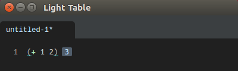

# Quick Start

> Note: This book is a work in progress and under heavy revision. Some content may be inaccurate, describe features no longer supported, or just plain wrong.

Here you will learn about how to use the next generation code editor, Light Table. We will start with the basics and work our way to more advanced features and usages.

While not comprehensive, the following should point you to areas of interest in Light Table.

As Light Table is mostly written in Clojure(Script), we will highlight functionality for it here.

### Get Light Table

First we need to download Light Table. It can be obtained by the Download button on [Light Table's website](http://www.lighttable.com/). The download will be in the form of an archive (e.g., `.tar`, `.zip`) that you will need to extract.

### Clojure Eval

After starting Light Table, open a new file by pressing `Ctrl-N`. This will create a temporary file named `untitled-1`.

Since the new file is not yet a Clojure or ClojureScript file we will set the syntax to Clojure. To do so, press `Ctrl-Space` to open the command bar, type/select 'Set current editor syntax', then select Clojure from the list.

Next, type `(+ 1 2)` followed by pressing `Ctrl-Enter` (`Cmd-Return` on Mac). This installs dependencies, if any, and evals the expression, which should return `3` to the immediate right of the line.

### Clojure Instarepl

> Note: Instarepl currently only works for Clojure files (.clj), not ClojureScript.

> Note: The Instarepl is anticipated to be deprecated due to a lack of a maintainer and removed entirely starting with v0.9.0.

The Instarepl is no longer packaged with Light Table by default. First we will need to install the plugin. Navigate to the command bar (`Ctrl-Space`) and type/select 'Plugins: Show plugin manager'. This will open up the plugin manager. Type 'clojureinstarepl' and press enter to get a list of results. Hover the mouse over the 'ClojureInstarepl' result and an option to install the plugin should appear on the right hand side. Click to install the plugin. It may be necessary to restart Light Table to ensure the new plugin is fully loaded.

With the Instarepl plugin installed, press `Ctrl-Space` to show the command bar, type "repl" in the command search box, and then select one item to run it:

  * Open a Clojure instarepl
  * Make current editor an instarepl

### User settings
You can access user settings by opening the Commands menu (`Ctrl-Space`) and typing `Settings: `. The following items should appear in the menu:

* Settings: User keymaps
* Settings: User behaviors
* Settings: Default keymaps
* Settings: Default behaviors
* Settings: Workspace behaviors

Alternatively, the same settings files are accessible in the following locations:

  * Mac: `~/Library/Application Support/LightTable/User/`
  * Linux: `~/.config/LightTable/User/`
  * Windows: `%APPDATALOCAL%/LightTable/User/`

### Plugins

Light Table's best features come from the plugins written by plugin authors. They can customize and enhance your Light Table experience to suit your needs. All published plugins can be found in Light Table's plugin manager, the [plugin meta repository](https://github.com/LightTable/plugin-metadata), or on Github.

### What next

You may want to

  * Check out the shortcuts. For default shortcuts and keymapping press `Ctrl-Space`, enter 'keymap', and choose 'Settings: Default keymap'. This file contains all shortcuts included in Light Table by default. If you wish to change or override any then do so in the user keymap.  

    The basic shortcuts
    ~~~
      Ctrl-W       close tab
      Ctrl-O       open file
      Ctrl-N       new file
      Ctrl-F       find
      Ctrl-Space   show command bar
      Ctrl-D       show document for selected function
      Ctrl-Shift-D show searchable language document bar
      Cmd-digit    switch to the Nth tab (Ctrl-digit on Linux)
    ~~~

  * To change various settings type Ctrl-Space `Settings: User behaviors`
  * Change a theme by editing the string theme name in (:lt.objs.style/set-theme "default") for example (:lt.objs.style/set-theme "ibdknox")
  * Try vim mode by adding (:lt.plugins.vim/activate-vim) (Note: The Vim plugin must be installed. See [this article](https://groups.google.com/forum/?fromgroups#!topic/light-table-discussion/TuJmH5Bpo2c) for details.)
  * Try emacs mode by adding (:lt.plugins.emacs/activate-emacs)
  * Questions and updates welcome.

---

Below are links users both new and old will find useful. 

### New Users

If you are coming from Vim, see [For Vim Users](/for-emac-users.md).

If you are coming from Emacs, see [For Emacs Users](/for-vim-users.md).

### Tutorials and Screencasts

  * [Getting the feel for the Light Table's instarepl](http://blog.maio.cz/2013/08/getting-feel-for-light-tables-instarepl.html) by Marian Schubert
  * [Set of screencasts](http://www.youtube.com/user/Misophistful/videos) on Clojure programming in LightTable by James Trunk
  * [Set of screencasts](http://www.zubairquraishi.com/zubairquraishi/clojurescript--light-table.html) on ClojureScript programming in LightTable by Zubair Quraishi
  * [ClojureScript Analysis & Compilation](http://swannodette.github.io/2014/01/14/clojurescript-analysis--compilation/) in LightTable by David Nolen  BROKEN LINK -- FIX!
  * Leveraging [custom expressions](https://groups.google.com/forum/#!topic/light-table-discussion/lyFzPGI2XMs) to write [Idiomatic Clojure](https://metaphysicaldeveloper.wordpress.com/2013/11/18/idiomatic-clojure-with-lighttable/) code by Daniel Ribeiro
  * [A Guide to Watches](https://medium.com/@zindlerb/guide-to-light-table-watches-fad560f698d3) by Brian Zindler
  * [How to programmatically manage a Light Table-aware nREPL server](http://manuelp.herokuapp.com/posts/14) by Manuel Paccagnella
